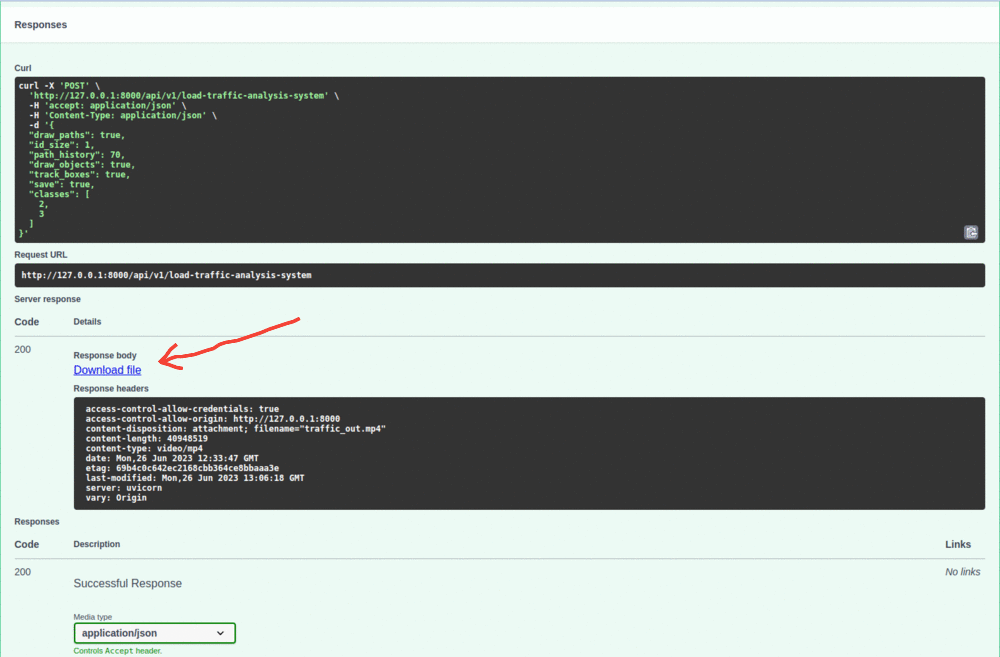

# traffic-analysis
Using the latest advancement in AI, Computer Vision and Deep Learning. It is automated traffic monitoring platform and traffic analytics solution for any entity that requires general traffic information for any purpose. It is designed and developed with the notion to provide ease of use and effective traffic analysis.

## Table of Contents
- [Installation and Run](#installation)
- [Usage](#usage)
- [API Endpoints](#api-endpoints)
- [Demo](#demo)

## Installation and Run

```bash
git clone https://github.com/bwithai/traffic-analysis.git
# set up your python env 
pip install -r requirements.txt
uvicorn main:app
# visit to: http://127.0.0.1:8000/docs#/
```

## Usage
Request body: localhost:8000/api/v1/load-traffic-analysis-system
```json
{
  "draw_paths": true,
  "id_size": 1,
  "path_history": 70,
  "draw_objects": true,
  "track_boxes": true,
  "save": true,
  "classes": [
    2,
    3
  ]
}
```
If save is False it will show each frame at realtime, speed is depend on your system spec. If GPU 🤩

If save is True Please be patient, Traffic analysis and counting may take a while, the response will look like this


Click to Download the video

## API Endpoints
1.  POST localhost:8000/api/v1/upload  <---- Upload file
2. GET localhost:8000/api/v1/video/get-all-file-name  <---- Get all files
3. POST localhost:8000/api/v1/load-traffic-analysis-system  <---- Load traffic analysis model

## Demo
